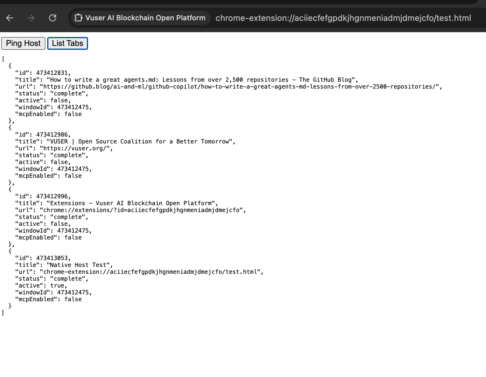

# Vuser Integration Guide

This guide outlines how Agent Developers and Web Publishers can integrate with the Vuser ecosystem.

## For Agent Developers

Agent developers can leverage the Vuser Browser Extension to interact with the browser and web pages programmatically. Communication is handled via the **Native Messaging Protocol**.

### Connecting to Vuser
Agents typically run as a local application that communicates with the Vuser extension through a Native Messaging Host (`org.vuser.protocol.host`).

### Protocol Commands
The Vuser extension accepts JSON messages with specific `action` commands.

#### 1. List Tabs
Retrieve a list of all open tabs, including their state and MCP availability.
```json
{
  "action": "getTabs"
}
```


> **Note:** The response includes an `mcpEnabled` flag for each tab. This allows agents to efficiently identify and prioritize sites that support the Model Context Protocol (MCP) without needing to inspect every page manually.

#### 2. Create Tab
Open a new tab with a specific URL.
```json
{
  "action": "createTab",
  "url": "https://example.com",
  "active": true
}
```

#### 3. Switch Tab
Focus a specific tab and its window.
```json
{
  "action": "switchTab",
  "tabId": 123
}
```

#### 4. Call MCP Tool
Execute a Model Context Protocol (MCP) tool exposed by a web page.
```json
{
  "action": "callMcp",
  "tabId": 123,
  "function": "toolName",
  "args": ["arg1", "arg2"]
}
```

---

## For Web Publishers

Web publishers can make their applications "Agent-Ready" by exposing an MCP (Model Context Protocol) interface. This allows AI agents to interact with your site securely and structuredly.

### Exposing MCP Tools
To expose tools to Vuser, define a global `window.vuserMcp` (or `window.mcp`) object in your web page's JavaScript.

```javascript
window.vuserMcp = {
  /**
   * Example tool: Search the site
   * @param {string} query - The search query
   * @returns {object} - Search results
   */
  search: async function(query) {
    // Your internal search logic
    const results = await internalSearchApi(query);
    return results;
  },

  /**
   * Example tool: Get current item details
   * @returns {object} - Item details
   */
  getItemDetails: function() {
    return {
      id: "item-123",
      name: "Sample Product",
      price: 19.99
    };
  }
};
```

### Benefits
*   **Discoverability**: Vuser automatically detects if your site has MCP enabled (`mcpEnabled: true`).
*   **Control**: You define exactly what functions are available to agents.
*   **Monetization**: (Future) Receive VOC coins for serving high-value agent requests.
