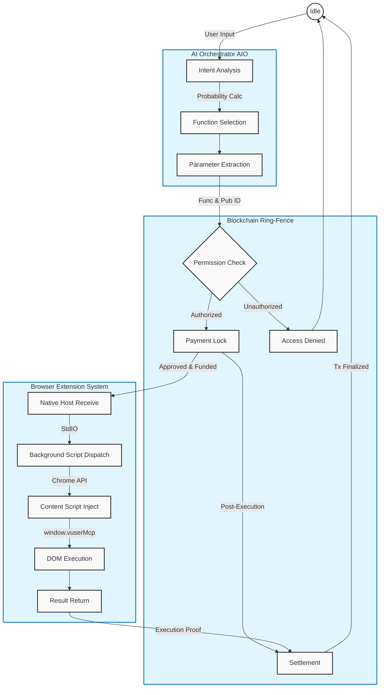

# Architecture State Flow

```mermaid
graph TD
    %% Nodes
    Idle((Idle))
    
    subgraph AIO [AI Orchestrator AIO]
        IntentAnalysis[Intent Analysis]
        FunctionSelection[Function Selection]
        ParameterExtraction[Parameter Extraction]
        
        IntentAnalysis -->|Probability Calc| FunctionSelection
        FunctionSelection --> ParameterExtraction
    end

    subgraph Blockchain [Blockchain Ring-Fence]
        PermissionCheck{Permission Check}
        PaymentLock[Payment Lock]
        AccessDenied[Access Denied]
        Settlement[Settlement]
        
        PermissionCheck -->|Authorized| PaymentLock
        PermissionCheck -->|Unauthorized| AccessDenied
        PaymentLock -->|Post-Execution| Settlement
    end

    subgraph Extension [Browser Extension System]
        HostReceive[Native Host Receive]
        BGDispatch[Background Script Dispatch]
        CSInject[Content Script Inject]
        DOMExecute[DOM Execution]
        ResultReturn[Result Return]
        
        HostReceive -->|StdIO| BGDispatch
        BGDispatch -->|Chrome API| CSInject
        CSInject -->|window.vuserMcp| DOMExecute
        DOMExecute --> ResultReturn
    end

    %% Flow
    Idle -->|User Input| IntentAnalysis
    ParameterExtraction -->|Func & Pub ID| PermissionCheck
    PaymentLock -->|Approved & Funded| HostReceive
    ResultReturn -->|Execution Proof| Settlement
    Settlement -->|Tx Finalized| Idle
    AccessDenied --> Idle

    %% Styling
    classDef default fill:#f9f9f9,stroke:#333,stroke-width:2px;
    classDef cluster fill:#e1f5fe,stroke:#0277bd,stroke-width:2px;
    class AIO,Blockchain,Extension cluster;
```
