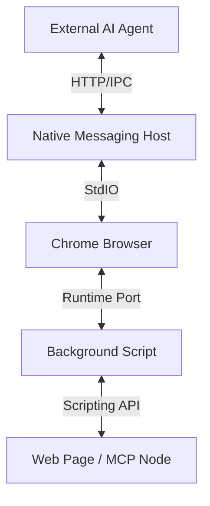

# Vuser Browser Extension Integration

The Vuser Browser Extension is the physical bridge between the **AI Orchestrator (AIO)** and the user's web browsing experience. It enables external AI agents to securely query browser state, switch contexts, and execute deterministic functions on publisher websites via the **Model Context Protocol (MCP)**.

## Architecture

The extension operates using a **Native Messaging** architecture, allowing it to communicate with a local "Host" process (the AI Agent or a local server) that runs outside the browser sandbox.



### Components

1.  **Native Messaging Host (`host.py`)**:
    - A standalone Python process that runs on the user's machine.
    - Acts as a server (HTTP port 8080) for external AI agents.
    - Communicates with the Chrome Extension via Standard Input/Output (StdIO).
    - **Role**: The "Gateway" that allows external apps to control the browser.

2.  **Background Script (`background.js`)**:
    - The central controller within the browser extension.
    - Maintains a persistent connection to the Native Host.
    - Uses the `chrome.tabs` and `chrome.scripting` APIs to manipulate browser state.
    - **Role**: The "Router" that dispatches commands to specific tabs.

3.  **Content Injection (MCP Execution)**:
    - The extension injects scripts into the target web page to access the `window.vuserMcp` object.
    - This ensures that the AI executes *only* the functions explicitly exposed by the publisher.
    - **Role**: The "Executor" that performs the delegated action.

## API Reference

The Native Host exposes a local HTTP API for AI Agents to interact with the browser.

### 1. Query Open Tabs
Retrieves the state of all open tabs to help the AI understand the user's current context.

- **Endpoint**: `GET /tabs`
- **Response**:
  ```json
  [
    {
      "id": 12345,
      "title": "Vuser Dashboard",
      "url": "https://vuser.org/dashboard",
      "active": true,
      "windowId": 1
    },
    ...
  ]
  ```

### 2. Switch Tab
Switches the browser's focus to a specific tab, allowing the AI to "see" what the user sees or prepare for an action.

- **Endpoint**: `POST /switch`
- **Body**: `{"tabId": 12345}`
- **Effect**: Brings the tab to the foreground and focuses the window.

### 3. Create Tab
Opens a new tab to a specific URL, useful for navigating to a service that isn't currently open.

- **Endpoint**: `POST /create`
- **Body**: `{"url": "https://example.com", "active": true}`
- **Response**: Returns the new tab's ID and details.

### 4. Call MCP Function
Executes a deterministic function defined in the publisher's MCP Node.

- **Endpoint**: `POST /mcp`
- **Body**:
  ```json
  {
    "tabId": 12345,
    "function": "bookFlight",
    "args": ["Boston", "2023-12-25"]
  }
  ```
- **Mechanism**:
  1. The Host sends the request to `background.js`.
  2. `background.js` uses `chrome.scripting.executeScript` to run code in `tabId`.
  3. The injected script calls `window.vuserMcp.bookFlight("Boston", "2023-12-25")`.
  4. The result is returned back up the chain to the AI Agent.

## Security Model

- **No Direct DOM Access**: The external agent *cannot* arbitrarily read or write to the DOM. It can only call specific functions exposed via `window.vuserMcp`.
- **User Consent**: The Native Host must be explicitly installed and the extension explicitly loaded by the user.
- **Manifest Permissions**: The extension requests only necessary permissions (`tabs`, `scripting`, `nativeMessaging`) to function.
