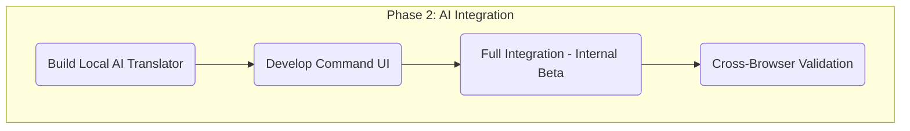
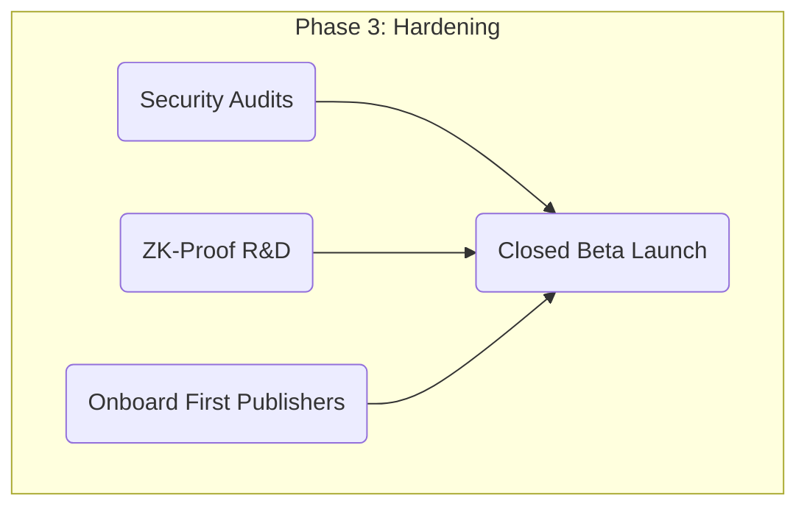
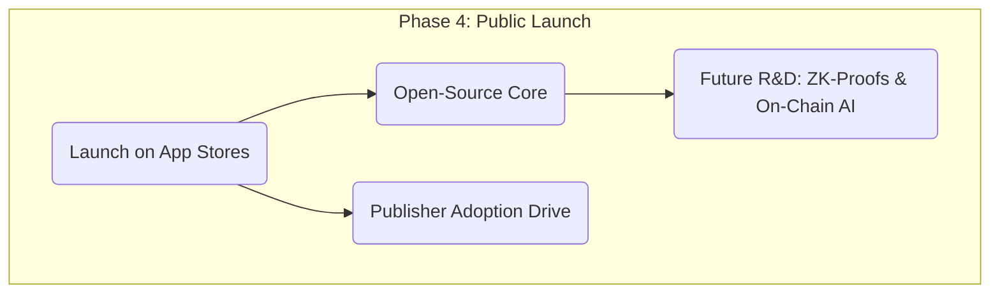

Here is the `roadmap.md` file, complete with summaries and Mermaid diagrams, synthesizing all the phases we planned.

-----

### 📄 `roadmap.md`

````md
# Vuser Protocol Development Roadmap

This document outlines the phased development roadmap for the Vuser Protocol, from initial specification to public launch.

---

## Phase 0: Foundation & Protocol Definition (Q1 - Q2 2026)

**Objective:** Define the core specifications, architecture, and technical feasibility before implementation.

* **MCP Specification:** Finalize the data structures for the Model Context Protocol (MCP) and the `vuser-manifest.json` standard for publishers.
* **Blockchain Architecture:** Select a scalable blockchain (L2/sidechain) and design the core smart contracts for permissioning (`PermissionRegistry.sol`) and value exchange.
* **Security Framework:** Define the AI agent's sandboxed environment and the "Local Processing First" strategy.
* **Extension Scaffolding:** Create a unified WebExtensions API codebase for Chrome (Manifest V3) and Firefox.

```mermaid
graph TD
    subgraph P0 [Phase 0: Foundation]
        A[Define MCP Specification] --> B(Architect Blockchain Layer);
        A --> C(Design Security Framework);
        B --> D(Extension Scaffolding);
        C --> D;
    end
````

-----

## Phase 1: Core MCP & MVP Build (Q3 - Q4 2026)

**Objective:** Build the non-AI scaffolding of the protocol and prove the core mechanics work on both browsers.

  * **Develop MCP:** Implement the browser extension's background service to read tab states and detect publisher manifests.
  * **Testnet Deployment:** Deploy the v1 smart contracts (`PermissionRegistry.sol`) to a public testnet.
  * **MVP Alpha:** Deliver a functional Alpha extension for Chrome and Firefox.
  * **MVP Goal:** Prove the full loop: On-chain permission grant -\> Browser MCP reads permission -\> MCP executes a permitted action *manually* via a dev panel.

<!-- end list -->

```mermaid
graph TD
    subgraph P1 [Phase 1: MVP Build]
        A(Develop Browser MCP) --> C(MVP Alpha);
        B(Testnet Contract Deployment) --> C;
        C --> D[Prove Full Loop: Permission -> MCP -> Action];
    end
```

-----

## Phase 2: AI Agent Integration (Q1 - Q2 2027)

**Objective:** Integrate the "brain" (the AI agent) that will autonomously translate user commands and utilize the MCP.

  * **Local AI "Action Translator":** Develop/fine-tune a small, on-device AI model (Web-LLM/ONNX) to translate natural language into structured MCP actions.
  * **Vuser Command UI:** Implement the user-facing chat/command interface within the extension.
  * **Internal Beta:** Release a feature-complete internal beta.
  * **Beta Goal:** User types command -\> AI translates -\> Extension confirms -\> MCP executes the action on the page.
  * **Cross-Browser Validation:** Ensure AI performance and MCP interactions are consistent on both Chrome and Firefox.

<!-- end list -->



-----

## Phase 3: Security Hardening & Decentralization (Q3 - Q4 2027)

**Objective:** Address advanced privacy/security concerns, audit the system, and onboard the first real-world partners.

  * **Security Audits:** Conduct full external audits of the WebExtensions and all smart contracts.
  * **ZK-Proof R\&D:** Begin research and prototyping for v2, using zero-knowledge proofs for private value exchange.
  * **Publisher Onboarding:** Onboard the first "Coalition" publishers, moving from test sites to real-world partners.
  * **Publisher SDK:** Deliver the `publisher-sdk` (validator, mock agent) to help partners integrate.
  * **Closed Beta Launch:** Launch an invite-only beta for Chrome and Firefox.

<!-- end list -->



-----

## Phase 4: Public Launch & Ecosystem Growth (2028+)

**Objective:** Launch publicly and shift focus from core development to ecosystem adoption and decentralization.

  * **Public Launch:** Launch the Vuser Protocol extensions on the Chrome Web Store and Firefox Add-ons (AMO) store.
  * **Open-Source:** Open-source the core components: MCP specification, AI "Action Translator" model, and smart contracts.
  * **Adoption Drive:** Actively work with publishers to integrate the `vuser-manifest.json` standard.
  * **Future R\&D:** Implement ZK-proofs (from P3 R\&D) and research on-chain verified AI models for a fully trustless system.

<!-- end list -->



```
```